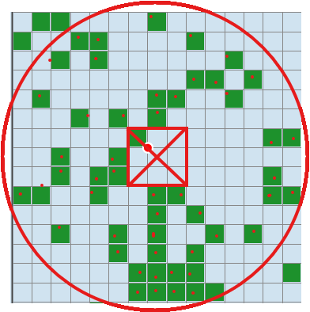
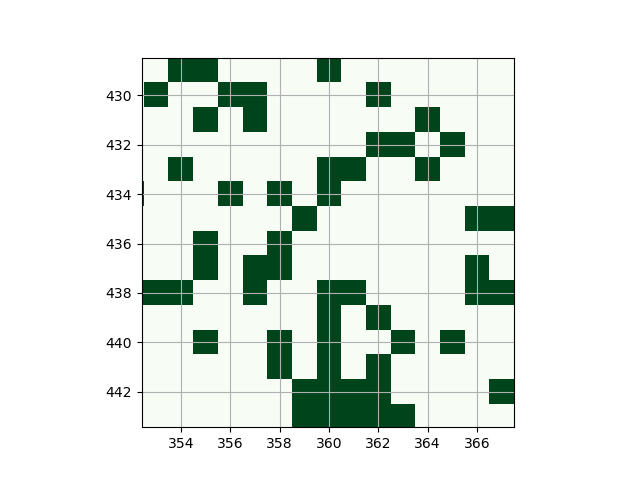

# Slime Chunk Counter

Count the number of Slime blocks in a given area of Minecraft (find the largest slime farm possible)

## Preview

Slime chunk number: 50, seed: 2772304346537327921, afk chunk position: (360, 436)

[Chunkbase.com:](https://www.chunkbase.com/apps/slime-finder#seed=2772304346537327921&platform=java&x=5760&z=6976&zoom=1.2)



get_chunk_map.py:



## Usage

1. Clone repositories

```shell
git clone https://github.com/dunxuan/SlimeChunkCounter.git
cd SlimeChunkCounter
```

2. Create Conda environment

```shell
conda env create -f environment.yml --prefix "./.conda"
```

3. Run Code

```shell
conda activate ./.conda
python run.py
```

### Command Line Arguments

```shell
# Interactive mode (default)
python run.py

# Specify a seed
python run.py -s 12345

# Specify all parameters
python run.py -s 12345 -r 2048 -t 55

# Multiple seeds mode (random search)
python run.py -m

# Force interactive mode
python run.py -i
```

| Argument | Description |
|----------|-------------|
| `-s, --seed` | World seed (-2^63 ~ 2^63-1) |
| `-r, --radius` | Chunk detection radius (default: 1024, max: 100000) |
| `-t, --threshold` | Count threshold (default: 50, max: 177) |
| `-m, --multiple` | Multiple seeds mode, random search |
| `-i, --interactive` | Force interactive mode |
| `--resume` | Resume from last checkpoint (multiple seeds mode) |
| `--clear-checkpoint` | Clear checkpoint and start fresh |

### Output

Results are automatically saved to:
- `results/results_*.csv` - CSV file with all matches
- `log/*.log` - Detailed log files

## Draw a map of a seed

```shell
# Interactive mode
python get_chunk_map.py

# Command line mode
python get_chunk_map.py -s 7981483398353467015 -r 500

# With AFK point highlight
python get_chunk_map.py -s 7981483398353467015 -r 500 -x -68 -z 437

# Save without showing
python get_chunk_map.py -s 7981483398353467015 -r 500 --no-show
```

| Argument | Description |
|----------|-------------|
| `-s, --seed` | World seed |
| `-r, --radius` | Chunk detection radius (default: 500) |
| `-x, --afk-x` | AFK point X coordinate (chunk) |
| `-z, --afk-z` | AFK point Z coordinate (chunk) |
| `-o, --output` | Output file path |
| `--no-show` | Don't display the image |

## Features

- 🚀 GPU accelerated with CUDA
- 📊 CSV result export
- 💾 Checkpoint/resume support
- 📷 Visualization with chunk maps
- ⚡ FP16 half-precision optimization (RTX/GTX 16xx+)
